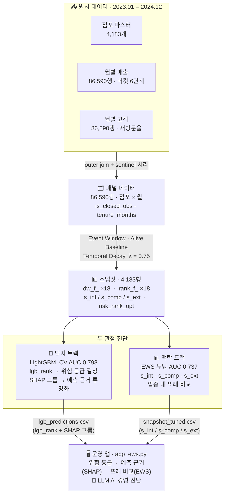

# 성동구 소상공인 경영위기 조기경보 시스템 (EWS)
### ML 탐지 · SHAP 설명 · EWS 동일 업종 비교 · LLM 경영 진단

> **2025 빅콘테스트 AI데이터 분석분야**  
> 우리 동네 가맹점, 위기 신호를 미리 잡아라!  
> 가천대학교 응용통계학과 — 김영민 · 박형건 · 오휘연 · 한민규

---

## 목차

1. [연구 배경 및 필요성](#1-연구-배경-및-필요성)
2. [문제 정의](#2-문제-정의)
3. [전체 시스템 아키텍처](#3-전체-시스템-아키텍처)
4. [연구 가설 및 차별성](#4-연구-가설-및-차별성)
5. [데이터 파이프라인](#5-데이터-파이프라인)
6. [주요 EDA 발견](#6-주요-eda-발견)
7. [피처 엔지니어링](#7-피처-엔지니어링)
8. [모델 설계](#8-모델-설계)
9. [전체 모델 성능 비교](#9-전체-모델-성능-비교)
10. [3단계 검증 체계](#10-3단계-검증-체계)
11. [SHAP 분석](#11-shap-분석)
12. [연구 결론 및 시사점](#12-연구-결론-및-시사점)
13. [연구 한계 및 향후 과제](#13-연구-한계-및-향후-과제)
14. [위험 등급 및 맞춤 금융 서비스](#14-위험-등급-및-맞춤-금융-서비스)
15. [LLM 기반 AI 경영 진단](#15-llm-기반-ai-경영-진단)
16. [대시보드](#16-대시보드-로컬-실행)
17. [프로젝트 구조](#17-프로젝트-구조)
18. [데이터 및 환경](#18-데이터-및-환경)
19. [참고문헌](#19-참고문헌)

---

## 1. 연구 배경 및 필요성

소상공인과 자영업자는 지역 상권과 소비 흐름을 지탱하는 핵심적인 경제 주체이다. 그러나 이들은 경기 침체, 소비 트렌드 변화, 임대료 상승 등 외부 환경 변화에 구조적으로 취약하며, 이러한 요인은 매출 감소와 고객 이탈을 거쳐 폐업으로 이어지는 경영 위기를 초래한다.

문제는 위기 신호가 **데이터 상에서는 폐업 수개월 전부터 먼저 나타난다**는 점이다. 실제 폐업이라는 결과로 가시화되기까지 상당한 시차가 존재하므로, 위기를 사후적으로 인식하는 방식에서 벗어나 경영 데이터를 기반으로 위험 신호를 조기에 탐지하고 선제적으로 대응하는 체계적 분석이 요구된다.

분석 대상인 서울 성동구는 성수동 중심의 신흥 상권과 전통 상권이 공존하는 이중 구조를 지니고 있어, 상권 간 경쟁 강도와 생존 환경의 격차가 크게 나타난다. 특히 요식업 중심의 영세·중소 가맹점은 이러한 구조적 변화에 가장 민감하게 노출되어 있으며, 폐업 위험이 단기간에 급격히 증폭되는 특성을 보인다.

> 최근 10년간 국내 카페 수는 약 45% 증가한 반면 폐업 수는 181% 증가하였으며, 서울 지역 커피·음료 업종의 5년 생존율은 34.9%에 불과하다 (모카뉴스, 2024).

기존의 소상공인 지원 정책은 폐업 이후의 사후적 구제나 일괄적 재정 지원에 초점을 맞추어 경영 위기의 **골든타임(8개월)** 을 놓치는 한계를 지닌다.

---

## 2. 문제 정의

### 2.1 타겟 정의

본 연구에서는 **공식 폐업일 정보가 확인된 점포**를 폐업 점포로 정의하고, 분석 시점 이후 영업이 지속되는 점포를 정상군으로 설정한다.

- **폐업 레이블**: `is_closed_obs = 1` — 관측 기간(2023.01~2024.12) 내 폐업일 확인
- **기저율**: **0.72%** (4,183개 중 30개)

### 2.2 관측 윈도우: 폐업 직전 8개월

| 근거 | 내용 |
|------|------|
| 소진공 실태조사 | 폐업 소상공인의 창업~폐업 평균 **6.4개월** → 8개월이 주요 임계점 |
| 신용보증기금 연구 | 부실 예측 핵심 변수: '과거 6개월 최소매출액', '3개월 건수 평균' |
| 정책 개입 리드타임 | 단기(3개월)·중기(6개월) 변동 지표의 유효성 + 충분한 개입 여유 |

### 2.3 기존 예측 모델의 한계

| 한계 | 설명 |
|------|------|
| **클래스 불균형** | 폐업률 0.72% → "모두 생존 예측" 정확도 99.3%라는 허상 |
| **버킷 데이터 제약** | 매출·거래량이 연속값이 아닌 **6단계 구간값** 형태 → 비선형 분할 효과 제한 |
| **이진 분류의 맥락 부재** | "폐업 확률 32.7%"는 동종 업종·상권 맥락 없이 해석 불가 |
| **데이터 누수** | 폐업 이후 데이터 포함 시 AUC 과대평가 |

### 2.4 순위 기반 접근

본 연구는 **신용평가모형(Credit Scoring Model)** 의 사고방식을 차용하여, 폐업 확률 예측보다 **상대적 위험 순위**를 산출하는 스코어링 모델을 설계하였다. 성능 지표는 정확도가 아닌 **AUC-ROC 와 Lift@K** 를 핵심으로 채택하였다.

```
기존: 폐업 확률 32.7%      →   순위 기반: 업종 내 상위 8% → 🔴 위험
      폐업 확률 31.9%      →   순위 기반: 업종 내 상위 52% → 🔵 주의
```

---

## 3. 전체 시스템 아키텍처



---

## 4. 연구 가설 및 차별성

### 연구 가설

**H1**: 폐업점은 폐업 직전 8개월 동안 거래·매출의 급격한 감소, 고객 구성 불안정, 운영 효율성 저하 등 **내부 행동 변화**가 통계적으로 유의미하게 나타난다.

**H2**: 상권 구조·업종 과밀도 등 외부 환경 요인은 장기적 배경 요인으로 작용하나, 단기 조기경보 관점에서는 **점포 내부 행동 요인**이 더 강력한 선행 신호를 제공한다.

### 차별성

1. **희귀 이벤트 환경 대응** — 폐업률 0.72%에서도 안정적으로 작동하는 순위 기반 조기경보 모델
2. **정교한 전처리 구조** — Event Window + Temporal Decay (λ=0.75) + Alive Baseline 3중 결합
3. **두 관점 진단 아키텍처** — LightGBM+SHAP(예측 근거 투명화)와 EWS(업종 내 또래 비교)를 병렬로 제공하여 "왜 위험한가"와 "어디가 취약한가"를 동시에 답함
4. **LLM 기반 실무 연계** — LightGBM·SHAP·EWS의 정량 결과를 LLM이 자연어 경영 진단 리포트로 변환 (진단 요약 → 관측 → 가설 해석 → 단계별 실행 계획 → 맞춤 금융상품 추천)

---

## 5. 데이터 파이프라인

### 5.1 입력 데이터

| 파일 | 행 수 | 주요 컬럼 | 비고 |
|------|-------|-----------|------|
| `dataset1` | 4,183 | ENCODED_MCT, ARE_D, MCT_ME_D, 업종, 상권 | 점포 마스터 |
| `dataset2` | ~86,590 | TA_YM, RC_LEVEL (매출 버킷 1~6) | 월별 매출 |
| `dataset3` | ~86,590 | TA_YM, MCT_UE_CLN_REU_RAT (재방문율), 유동/주거 비중 | 월별 고객 |

- **매출 버킷**: `'5_75-90%'` 형식의 문자열 → 정수 1~6으로 변환 (1=최우량, 6=최취약)
- **Sentinel 처리**: `-999999.9` (float), `-999999` (int) → `NaN` 으로 치환

### 5.2 패널 구축

```python
panel = sales ⊗ customer  (outer join on [ENCODED_MCT, TA_YM])
panel = panel ⊗ master    (left join on ENCODED_MCT)

panel['tenure_months']    = (TA_YM_dt - ARE_D_dt)        # 개업 후 경과 개월
panel['months_to_close']  = (MCT_ME_D_dt - TA_YM_dt)     # 폐업까지 잔여 개월
panel['is_closed_obs']    = MCT_ME_D_dt ∈ [2023-01, 2024-12]  # 폐업 레이블
```

### 5.3 Event Window 정렬

```
폐업점:  [폐업 8개월 전, ..., 폐업 1개월 전]  → rel_month = -8 ~ -1
생존점:  [가장 최근 8개월]                    → rel_month = -8 ~ -1
```

- 관측 기간 3개월 미만 점포는 분석 제외
- 절대 날짜가 다른 두 집단을 동일한 상대 시간 축으로 정렬

### 5.4 Alive Baseline

> 정보 누수 차단: **생존점 데이터만**으로 업종 × 월별 기준값을 산출

```python
baseline = panel[is_closed_obs == 0].groupby(['업종', 'TA_YM'])['매출버킷'].median()
panel['매출_대비기준'] = panel['매출버킷'] / baseline
```

폐업점을 기준값 산출에 포함시키면 폐업 예정 점포의 낮은 매출이 기준을 끌어내려 분리력이 희석된다.

---

## 6. 주요 EDA 발견

### 폐업 직전 행동 변화 궤적 (H1 채택)

```
매출 버킷 평균값 (1=최우량, 6=최취약)
T-12   T-9    T-6    T-3    T-0(폐업)
 3.71 ─ 3.72 ─ 3.74 ─ 3.75 ─── 4.43  ← 급등
                              ↑ 조기경보 골든타임
```

### 피처 중요도 — Mann-Whitney Effect Size (H2 채택)

> **추세 피처 >> 수준 피처: 2.5배 강한 분리력**

| 피처 | Effect Size | 순위 |
|------|-------------|------|
| 매출 추세 (3개월 차분) | 0.247 | 1위 |
| 재방문율 | 0.183 | 2위 |
| 거래 추세 | 0.182 | 3위 |
| 매출 수준 | 0.171 | 4위 |

### 상권별 분석: 매출↑ ≠ 안전

| 상권 | 평균 매출 | 폐업률 | 시사점 |
|------|-----------|--------|--------|
| 성수2가 | 높음 | 높음 | 경쟁 과열, 구조적 리스크 |
| 왕십리 | 높음 | 높음 | 유동 인구 의존도 높아 변동성 큼 |
| 마장동 | 낮음 | 낮음 | 안정적 단골 기반 상권 |

---

## 7. 피처 엔지니어링

### 7.1 시간감쇠 가중 집계 (Temporal Decay)

```
λ = 0.75  (3개월 전 가중치 = 현재의 42%)

w_t = λ^(T - t)          (t: 현재, T: 관측 시작)
dw_feature = Σ(w_t × feature_t) / Σ(w_t)
```

### 7.2 18개 피처 구성

내부 10개 · 경쟁 6개 · 외부 2개로 구성된다. 각 피처는 감쇠가중(`dw_f_*`) 집계값과 업종·상권 내 백분위(`rank_f_*`) 두 형태로 스냅샷에 저장된다.

<details>
<summary>피처 상세 정의 (클릭해서 보기)</summary>

**내부 신호 (Internal, 10개)**

| 피처명 | 정의 | 비고 |
|--------|------|------|
| `dw_f_sales_lvl` | 감쇠가중 매출 버킷 평균 | 낮을수록 위험 |
| `dw_f_trx_lvl` | 감쇠가중 거래 건수 수준 | |
| `dw_f_spend_lvl` | 감쇠가중 객단가 수준 | |
| `dw_f_sales_trend` | 매출 수준의 선형 기울기 (8개월) | **EDA 1위 분리력** |
| `dw_f_trx_trend` | 거래 건수의 선형 기울기 | SHAP 1위 |
| `dw_f_return_rate` | 감쇠가중 재방문율 | 단골 기반 붕괴 신호 |
| `dw_f_return_trend` | 재방문율 추세 | |
| `dw_f_float_ratio` | 유동인구 고객 비중 | 높을수록 불안정 |
| `dw_f_float_trend` | 유동인구 비중 추세 | |
| `dw_f_resid_ratio` | 상주인구 고객 비중 | SHAP 5위 |

**경쟁 신호 (Competitive, 6개)**

| 피처명 | 정의 |
|--------|------|
| `dw_f_rank_ind` | 업종 내 매출 순위 (백분위) |
| `dw_f_rank_dist` | 상권 내 매출 순위 |
| `dw_f_rank_ind_trend` | 업종 내 순위 추세 |
| `dw_f_rank_dist_trend` | 상권 내 순위 추세 |
| `dw_f_vs_ind_sales` | 업종 평균 대비 매출 비율 |
| `dw_f_vs_ind_trend` | 업종 평균 대비 추세 |

**외부 신호 (External, 2개)**

| 피처명 | 정의 | 설계 원칙 |
|--------|------|-----------|
| `dw_f_peer_close_ind` | 업종 내 주변 폐업 밀도 | 수준이 아닌 변화의 크기만 반영 |
| `dw_f_peer_close_dist` | 상권 내 주변 폐업 밀도 | 내부 위험 점포에서 조건부 강화 |

</details>

### 7.3 스냅샷 구조 (4,183행 × 53컬럼)

```
ENCODED_MCT, MCT_NM, 업종, 상권           ← 식별 정보 (4)
dw_f_sales_lvl ~ dw_f_peer_close_dist     ← 감쇠가중 피처 (18)
rank_f_sales_lvl ~ rank_f_peer_close_dist ← 업종+상권 내 백분위 (18)
s_int, s_comp, s_ext                      ← EWS 컴포넌트 점수 (3)
risk_score_opt, risk_rank_opt             ← EWS 최종 점수·등급 (2)
n_obs_months, is_closed_obs              ← 관측 정보·레이블 (2 + 기타)
```

---

## 8. 모델 설계

이 시스템은 소상공인 경영위기를 **두 가지 독립적인 관점**으로 진단한다.

### 관점 1 — 탐지 트랙: "이 점포가 왜 위험한가?"

`dw_f_*` → **LightGBM(CV AUC 0.798)** → `lgb_rank`(위험 등급) + **SHAP 그룹 합산** → `shap_int_pct / shap_comp_pct / shap_ext_pct`

LightGBM이 예측한 위험 등급의 근거를 내부·경쟁·외부 3개 피처 그룹의 SHAP 기여도로 설명한다. 등급을 결정한 모델과 설명이 완전히 일치하여 예측 근거가 투명하게 드러난다.

```
예: "이 점포는 내부 요인(매출·거래·고객)의 SHAP 기여도가 업종 내 상위 2% — 내부 악화가 LGB 위험 예측을 주도하고 있다."
```

### 관점 2 — 맥락 트랙: "같은 업종 또래들과 비교해서 어디가 취약한가?"

`rank_f_*` → **EWS 튜닝(AUC 0.737)** → `s_int / s_comp / s_ext`

업종·상권 그룹 내 백분위 기반 상대 비교로, 담당 공무원이 현장에서 즉시 이해할 수 있는 맥락을 제공한다. "이 점포가 동종 업종에서 하위 몇 %인가"를 3차원으로 보여준다.

```
예: "같은 업종 내 내부 지표 하위 8%, 경쟁 환경 하위 15% — 내부가 더 시급하다."
```

> **두 관점은 앙상블이 아니다.** 예측값을 혼합하거나 합산하지 않는다. 서로 다른 질문에 답하며, 대시보드에 나란히 표시되어 진단의 완전성을 높인다.

### 8.1 탐지 트랙: LightGBM 학습 과정

**데이터 흐름**

```
원시 패널 86,590행 (점포 × 월)
    ↓ Event Window(8개월) + Temporal Decay(λ=0.75) + Alive Baseline
스냅샷 4,183행 × 18피처  ← LightGBM 학습 입력
    ↓ StratifiedKFold(n=5)
학습 목표: 4,183개 점포 중 폐업 30개를 위험 순위 상위로 끌어올리는 분리력 극대화
```

86,590행의 시계열 정보는 피처 엔지니어링 단계에서 점포당 18개 수치로 압축된다. LightGBM은 이 **4,183행 × 18피처 스냅샷**을 학습 입력으로 받아, 폐업(30개) vs 생존(4,153개)의 분리력을 학습한다.

**모델 선택 과정**

11개 모델을 동일 조건(StratifiedKFold 5-Fold, class_weight='balanced')으로 비교하였고, RandomizedSearchCV(n_iter=40)로 하이퍼파라미터를 최적화한 LightGBM이 CV AUC 0.798로 선정되었다.

단, 폐업 30개라는 극소표본 환경에서 모델 간 AUC 차이는 통계적으로 유의하지 않다. 따라서 최종 선택은 성능 수치보다 **SHAP 투명성**(두 관점 아키텍처 요건)과 **Lift@5% 우위**(7.3x)를 기준으로 하였다.

학습 후 SHAP 그룹 합산(`shap_int/comp/ext_pct`)으로 예측 근거를 내부·경쟁·외부 3차원으로 분해한다.

### 8.2 맥락 트랙: EWS 튜닝 알고리즘 (관점 2)

```
Step 1. 피처별 업종+상권 내 백분위 rank_f_* 산출
        rank_f_sales_lvl = percentilerank(dw_f_sales_lvl, 업종+상권 그룹)

Step 2. 컴포넌트 점수 계산 (단순 평균)
        s_int  = mean(rank_f_internal_10개)
        s_comp = mean(rank_f_competitive_6개)
        s_ext  = mean(rank_f_external_2개)

Step 3. 컴포넌트 점수를 전체 점포 내에서 다시 백분위화
        r_int  = percentilerank(s_int)
        r_comp = percentilerank(s_comp)
        r_ext  = percentilerank(s_ext)

Step 4. 최종 위험 점수 (가중 합산)
        risk_score = 0.65 × r_int + 0.30 × r_comp + 0.05 × r_ext

Step 5. 위험 점수 → 전체 백분위
        risk_rank = percentilerank(risk_score)
```

### 최종 점수 산출식

```
risk_score_opt = 0.65 × r_int + 0.30 × r_comp + 0.05 × r_ext

r_int  = percentilerank( s_int )   ─┐
r_comp = percentilerank( s_comp )   ├ 전체 점포 내 재백분위화 (0~100)
r_ext  = percentilerank( s_ext )   ─┘

s_int  = Σ(w_i × rank_f_i) / Σw_i   (내부 피처 10개, i ∈ I)
s_comp = Σ(w_c × rank_f_c) / Σw_c   (경쟁 피처  6개, c ∈ C)
s_ext  = Σ(w_e × rank_f_e) / Σw_e   (외부 피처  2개, e ∈ E)

w_*       = Mann-Whitney Effect Size = max(0, 2U / (n₁·n₂) − 1)
            [폐업 vs 생존 분리력 기반 데이터 주도 피처 가중치]

rank_f_*  = percentilerank(dw_f_* | 업종+상권 그룹) × 100
            [0~100, 높을수록 위험 — Alive Baseline 그룹 내 상대 순위]

dw_f_*    = Σ(λ^(T−t) × x_t) / Σ λ^(T−t),   λ = 0.75
            [Temporal Decay 집계 — 3개월 전 가중치 = 현재의 42%]

risk_rank_opt = percentilerank(risk_score_opt | 업종+상권 그룹) × 100
               [최종 운영 등급 기준값: 위험 ≥ 85%ile / 경고 ≥ 65%ile / 주의 ≥ 40%ile]
```

**가중치 최적화 (05_report_tuning)**: 3단계 체계적 탐색으로 λ, (w_int, w_comp, w_ext) 동시 최적화
- 최적 λ = **0.75**
- 최적 가중치 = **(0.65, 0.30, 0.05)**
- 임계값 = 위험 ≥ **85%ile**, 경고 ≥ **65%ile**, 주의 ≥ **40%ile**

### 8.3 LightGBM 하이퍼파라미터 상세

**입력**: `dw_f_*` 18개 피처 (4,183 × 18)  
**레이블**: `is_closed_obs` (30/4,183 = 0.72%)  
**검증**: `StratifiedKFold(n_splits=5, shuffle=True, random_state=42)`

**LightGBM 하이퍼파라미터 (RandomizedSearchCV, n_iter=40)**

| 파라미터 | 최적값 | 탐색 범위 |
|---------|--------|-----------|
| `n_estimators` | 200 | [100, 200, 300, 500] |
| `max_depth` | 6 | [3, 4, 5, 6, 7] |
| `num_leaves` | 15 | [15, 31, 63] |
| `learning_rate` | 0.2 | [0.05, 0.1, 0.2] |
| `subsample` | 0.6 | [0.6, 0.8, 1.0] |
| `colsample_bytree` | 0.6 | [0.6, 0.8, 1.0] |
| `min_child_samples` | 10 | [5, 10, 20] |
| `reg_alpha` | 0.1 | [0, 0.1, 0.5, 1.0] |
| `reg_lambda` | 0.1 | [0.1, 0.5, 1.0] |
| `class_weight` | `balanced` | 고정 (불균형 대응) |

<details>
<summary>비교 모델 하이퍼파라미터 (RF · XGBoost · CatBoost)</summary>

**RF 튜닝**

| 파라미터 | 최적값 |
|---------|--------|
| `n_estimators` | 200 |
| `max_depth` | None |
| `max_features` | `log2` |
| `min_samples_split` | 10 |
| `min_samples_leaf` | 8 |
| `class_weight` | `balanced` |

**XGBoost 튜닝**

| 파라미터 | 최적값 |
|---------|--------|
| `n_estimators` | 500 |
| `max_depth` | 3 |
| `learning_rate` | 0.1 |
| `subsample` | 1.0 |
| `colsample_bytree` | 0.6 |
| `min_child_weight` | 3 |
| `gamma` | 0 |
| `reg_alpha` | 0.5 |
| `reg_lambda` | 0.5 |
| `scale_pos_weight` | 139 (불균형 대응) |

**CatBoost 튜닝**

| 파라미터 | 최적값 |
|---------|--------|
| `iterations` | 200 |
| `depth` | 8 |
| `learning_rate` | 0.1 |
| `l2_leaf_reg` | 10 |
| `bagging_temperature` | 0.5 |
| `border_count` | 32 |
| `auto_class_weights` | `Balanced` |

</details>

<details>
<summary>앙상블 실험 (성능 비교 목적, notebook 04)</summary>

앙상블 세 가지를 모두 테스트했으나, 어떤 방식도 LightGBM 단독(0.798)을 초과하지 못했다. 결론적으로 LightGBM(탐지·예측 근거)과 EWS(업종 내 또래 비교)를 병렬로 제공하는 두 관점 진단 구조를 채택했다.

**Soft Voting (4-Model)**

```python
norm01(v) = (v - min) / (max - min)   # 모델별 스케일 통일

vote_prob = mean([
    norm01(rf_tuned_prob),
    norm01(xgb_prob),
    norm01(lgb_prob),
    norm01(cb_prob),
])
```

→ CV AUC 0.780 / Lift@5% 7.3x

**Stacking (Meta-LR)**

```
Base learners (6개): LR, RF_base, RF_tuned, XGB, LGB, CB
    └─ 각 모델의 OOF(Out-of-Fold) 예측 → meta feature matrix (4,183 × 6)

Meta learner: Logistic Regression (C=0.1)
    └─ meta feature를 입력으로 최종 예측
```

→ CV AUC **0.679** — 소표본 환경(폐업 30개)에서 meta-learner 학습 불안정  
→ RF 튜닝 메타 계수 +7.94, XGB 메타 계수 -1.86 (RF에 의존, 나머지 기여 미미)

**Hybrid (ML + EWS 혼합)**

```python
hybrid_prob = 0.30 × norm01(stack_prob) + 0.70 × norm01(ews_opt_prob)
```

→ CV AUC 0.758 — EWS의 해석 가능성을 유지하면서 ML의 탐지력 일부 흡수

</details>

---

## 9. 전체 모델 성능 비교

> 기저율: **0.72%** (4,183개 중 폐업 30개) · 18개 피처 기준 실행 결과

| 모델 | CV AUC | Lift@5% | Lift@10% | 비고 |
|------|--------|---------|----------|------|
| 로지스틱 회귀 | 0.605 | 3.3x | 2.7x | 베이스라인 |
| EWS 기본 | 0.668 | 2.7x | 2.3x | λ=0.75, 균등 가중 |
| Stacking (meta-LR) | 0.679 | 6.7x | 4.3x | 소표본 환경 불리 (폐업 30개) |
| RF 기본 | 0.735 | 5.3x | 4.0x | |
| **EWS 튜닝 ★** | **0.737** | **4.0x** | **4.3x** | 3단계 최적화 — **맥락 트랙 (업종 내 또래 비교)** |
| Hybrid (ML 30% + EWS 70%) | 0.758 | 5.3x | 4.0x | |
| RF 튜닝 | 0.764 | 6.7x | 4.3x | RandomizedSearchCV |
| XGBoost | 0.778 | 7.3x | 4.3x | |
| Soft Voting (4-Model) | 0.780 | 7.3x | 4.3x | RF+XGB+LGB+CB |
| **LightGBM ★** | **0.798** | **7.3x** | **4.3x** | **탐지 트랙 (등급 결정)** |
| CatBoost | 0.810 | 6.7x | 4.0x | 최고 CV AUC |

> **★ 최종 운영 시스템**: 두 관점 진단 구조 — LightGBM(탐지·SHAP 예측 근거) + EWS 튜닝(업종 내 또래 비교)  
> 실제 폐업 30개 기준 — LGB: 정상 오분류 **0개** | EWS: 정상 오분류 1개 + 평가불가 11개

### LightGBM 선택 근거

**전제: 폐업 30개 환경에서 모델 간 성능 비교의 한계**

4,183개 점포 스냅샷에서 폐업은 30개(0.72%)다. 5-Fold CV에서 폴드당 폐업 약 24개로 학습하고 6개로 검증한다. 이 환경에서 모델 간 AUC 차이는 통계적으로 유의하지 않다.

```
AUC 차이: 0.810(CB) - 0.798(LGB) = 0.012
Holdout 95%CI ≈ ±0.25  (test 폐업 6개 기준)
→ 0.012는 신뢰구간 내 노이즈 — 어떤 모델이 더 좋은지 수치로 증명 불가
```

따라서 선택 기준을 **성능 수치**가 아닌 **운영 목적과 설계 요건**으로 전환하였다.

**선택 기준 1 — Lift@5% (현장 투입 효율)**

```
현장 담당자가 한 달에 집중 점검할 수 있는 점포 ≈ 상위 200개 (전체의 5%)

상위 5%  ≈ 209개  →  LGB 7.3x (10~11개) vs CB 6.7x (9~10개): 1개 차이
상위 10% ≈ 418개  →  LGB 4.3x (13개)    vs CB 4.0x (12개):  1개 차이
```

두 구간 모두 LightGBM이 동등하거나 앞선다. 조기경보의 실전 목적(상위 위험군 선별)에서 LightGBM이 더 적합하다.

**선택 기준 2 — SHAP 투명성 (아키텍처 요건)**

이 시스템은 LightGBM 예측 근거를 내부·경쟁·외부 3그룹 SHAP으로 분해하는 구조다. Voting(4개 모델 앙상블)이나 CatBoost 대비 LightGBM의 TreeExplainer SHAP이 가장 깔끔하게 작동한다.

**선택 기준 3 — 단일 모델 운영 단순성**

Voting 대비 추론 속도·메모리·유지보수 비용 1/4 수준으로 운영 가능하다.

---

## 10. 3단계 검증 체계

```
① CV AUC (5-Fold StratifiedKFold) ← 모델 선택 기준
   목적: 모델 비교·선택 — 5개 fold 평균으로 단일 split보다 안정적
   결과: LightGBM 0.798 / EWS 튜닝 0.737
   한계: 하이퍼파라미터를 전체 CV로 선정 → 선택 편향 존재

② Holdout AUC (Stratified 20%) ← 이상 감지(sanity check) 전용
   목적: 학습 자체가 실패했는지 확인 — 모델 간 성능 비교 목적 아님
   ※ test 내 폐업 6개 → AUC 95%CI ±0.25
     → 모든 Δ 값이 신뢰구간 내 노이즈 — 상대 비교 불가
     → Holdout AUC가 0.5 이하로 붕괴하지 않는 한 정상 판정
   결과: 전 모델 Holdout AUC > 0.7 — 학습 실패 없음 ✓
   참고 (방향성만):
     CatBoost CV 0.810 → Holdout 0.748  Δ = -0.061  (CV > Holdout, 경미한 과대추정 가능성)

③ Temporal Holdout + Permutation Test (2023→2024) ← 가장 신뢰할 수 있는 검증
   목적: 진짜 미래 예측 능력 검증 — 미래 레이블 전혀 미사용
   방법: 2023 데이터로 스냅샷 구성 → 2024 폐업 레이블로 평가
         (Train: 2023 폐업 15개 / Eval: 2024 폐업 15개)

                              EWS 튜닝     LightGBM
   ─────────────────────────────────────────────────
   Temporal AUC (2023→2024)    0.611        0.631
   Lift@5%                     2.0x         0.0x  ←
   Permutation p-value        <0.001        0.038
   Z-score                     4.55σ        1.77σ
   ─────────────────────────────────────────────────

   EWS Bootstrap 95%CI [0.655, 0.818]: 2023 동시대 기준 모델 성능 추정 구간
   → Temporal AUC 0.611이 CI 하한(0.655) 아래 = Distribution Shift의 증거
```

> Temporal AUC 하락(0.80→0.61)은 **Distribution Shift** 의 자연스러운 반영이다. 2024년 매크로 경제 환경(금리·소비 변화)이 2023년 학습 데이터에 포함되지 않아 발생하는 현상으로, 모델 실패가 아니다.

**전향 검증이 두 관점 아키텍처를 강화하는 이유**

| | EWS 튜닝 | LightGBM |
|---|---|---|
| Temporal AUC | 0.611 | **0.631** |
| Lift@5% (상위 178개) | **2.0x** | 0.0x |
| Lift@10% (상위 356개) | **2.0x** | 0.7x |
| Permutation p | **<0.001** | 0.038 |
| Z-score | **4.55σ** | 1.77σ |

EWS Lift@5% = Lift@10% = 2.0x — 폐업 점포가 상위 5% 안에 이미 집중되어 있다. LightGBM은 Lift@10%까지 넓혀도 0.7x(1개 탐지)로, 폐업 점포가 상위 10~15% 구간에 분산되어 있다.

- **LGB**: 전체 순위 능력(AUC) 우위 — 동시대 패턴 학습 특화
- **EWS**: 상위 집중 탐지(Lift) 우위 + 통계적 유의성 압도(Z=4.55σ vs 1.77σ) — 업종 내 상대 비교 구조가 시간 이동에 견고

두 모델이 서로 다른 구간에서 강점을 가지므로 병렬 운영이 타당하다.

---

## 11. SHAP 분석

**탐지 트랙 최종 모델(LightGBM)** 기반 `shap.TreeExplainer` 로 18개 피처 기여도를 분석한다.  
등급을 결정한 모델과 설명 모델을 일치시켜 예측 근거를 직접 해석한다.

> LightGBM binary SHAP은 2D 배열(양성 클래스 직접 출력)로 RF의 3D 배열과 구조가 다르다.  
> `ndim == 3` 분기로 두 모델 모두 지원하도록 구현했다.

### 전역 피처 중요도 (LightGBM 기준)

| 순위 | 피처 | SHAP 방향 | 해석 |
|------|------|-----------|------|
| 1 | `dw_f_trx_trend` (거래 추세) | 음수↓ → 위험 | 거래 건수 감소 추세 — EDA 분리력 순위와 일치 |
| 2 | `dw_f_peer_close_ind` (업종 폐업 밀도) | 양수↑ → 위험 | 주변 동종업 폐업 증가 = 외부 압력 신호 |
| 3 | `dw_f_sales_trend` (매출 추세) | 음수↓ → 위험 | 매출 감소 추세 — **EDA 분리력 1위** |
| 4 | `dw_f_trx_lvl` (거래 건수) | 음수↓ → 위험 | 절대 거래량도 핵심 지표 |
| 5 | `dw_f_resid_ratio` (상주인구 비중) | 음수↓ → 위험 | 단골(상주) 비중 낮을수록 취약 |

**연구 가설과의 연결:**
- **H1 채택**: SHAP Top 5 중 4개가 내부 행동 지표(거래·매출 추세·수준, 단골 비중) → 폐업 직전 내부 변화가 가장 강력한 신호
- **H2 채택**: 외부 지표(`dw_f_peer_close_ind`)는 Top 2이지만 SHAP 절댓값은 내부 지표의 절반 수준 → 단기 조기경보에서 내부 신호가 지배적

### 개별 점포 설명 (Waterfall Plot)

LightGBM 위험 확률 상위 3개 점포의 폐업 리스크 요인을 분해한다.

```python
explainer = shap.TreeExplainer(lgb_rscv.best_estimator_)
top3_idx  = np.argsort(lgb_prob)[-3:][::-1]
shap.waterfall_plot(exp1[idx])   # 고위험 점포별 피처 기여도 분해
```

각 Waterfall은 **base value(전체 평균 예측)** 에서 출발해 개별 피처가 위험 확률을 얼마나 올리거나 내리는지 보여준다. 점포마다 주요 위험 요인이 달라 현장 맞춤형 개입 근거로 활용할 수 있다.

---

## 12. 연구 결론 및 시사점

### 주요 결론

본 연구는 폐업률 0.72%의 극희귀 이벤트 환경에서 소상공인 경영위기를 사전에 탐지하는 조기경보 시스템을 설계했다.

**1. 순위 기반 접근의 유효성 확인**  
이진 분류 대신 신용평가 방식의 상대적 위험 순위를 채택하여 클래스 불균형 문제를 우회했다. LightGBM CV AUC 0.798, Lift@5% 7.3x로 베이스라인(LR AUC 0.605) 대비 명확한 탐지 우위를 실증했다.

**2. 연구 가설 채택**
- **H1 채택**: 폐업 직전 8개월간 거래·매출 급감, 재방문율 저하 등 내부 행동 변화가 통계적으로 유의하게 선행함 (Mann-Whitney 분리력 1위 매출 추세 0.247)
- **H2 채택**: SHAP 분석에서 내부 지표의 기여도가 외부 지표보다 약 2배 높아, 단기 조기경보에서 내부 신호가 지배적

**3. 두 관점 아키텍처의 전향 검증**  
전향 검증(2023→2024)에서 LightGBM과 EWS가 서로 다른 강점을 가짐을 확인했다.
- LightGBM: 전체 순위 능력 우위 (Temporal AUC 0.631, p=0.038) — 동시대 패턴 학습 특화
- EWS: 상위 집중 탐지 우위 (Lift@5% 2.0x, p<0.001, Z=4.55σ) — 업종 내 상대 비교 구조가 시간 이동에 더 견고

두 모델이 서로 다른 차원에서 강점을 가져 병렬 운영이 단일 모델보다 현장 활용성이 높음을 실증했다.

### 정책적 시사점

- **골든타임 개입**: 폐업 8개월 전 위험 신호 탐지로 사후 구제 중심 정책에서 선제적 개입으로 전환 가능
- **자원 집중 효율**: 상위 5% 집중 경보(약 200개 점포)에 자원 투입 시 기저율 대비 7배 탐지 효율
- **맥락 있는 판단**: 절대 매출 기준이 아닌 업종·상권 내 상대 비교로 "매출이 높아도 업종 내 순위가 하락하는" 위험 점포 식별 가능
- **현장 연계**: LLM 기반 AI 리포트와 맞춤 금융상품 매칭으로 탐지 → 대응까지 원스톱 처리

---

## 13. 연구 한계 및 향후 과제

### 데이터 한계

| 한계 | 내용 | 영향 |
|------|------|------|
| **극소 폐업 표본** | 폐업 30개 (0.72%) | Holdout AUC 95%CI ≈ ±0.25 — 성능 추정값의 통계적 불안정성 |
| **버킷 데이터 제약** | 매출이 6단계 구간값으로 측정 | 연속적 변화 포착 제한, 정밀도 감소 |
| **단기 관측 기간** | 2023–2024 2년 데이터만 사용 | 경기 사이클·계절성 전체 반영 불가 |
| **데이터 비공개** | 대회 규정상 원본 데이터 레포 미포함 | 외부 재현 불가 |

### 모델 한계

- **이진 분류의 본질적 한계**: 현 시스템은 "폐업하는가/아닌가"를 예측하지만 **"언제 위험해지는가"를 예측하지는 못한다.** 8개월 윈도우 내 어느 시점에서 임계점을 넘는지, 위험도가 얼마나 빠르게 악화되는지는 알 수 없다. 이를 해결하려면 **생존분석(Survival Analysis)** 기법이 필요하다.

  > 생존분석 도입 시 가능해지는 것:  
  > - 각 점포별 생존함수 S(t) — "t개월 후에도 영업 중일 확률"  
  > - 잔여 수명(Expected Residual Time) 추정 — "현재부터 폐업까지 예상 기간"  
  > - 중도절단(Censored) 처리 — 관측 기간 내 폐업하지 않은 점포를 올바르게 반영  
  > 적용 후보: Cox Proportional Hazards, Random Survival Forest, DeepHit

- **Distribution Shift**: CV AUC 0.798 → Temporal AUC 0.631 — 2024년 매크로 경제 환경 변화(금리·소비)가 2023년 학습 데이터에 미반영
- **EWS 파라미터 최적화**: 전체 기간 데이터로 파라미터를 튜닝했으므로 전향 검증에서 경미한 낙관적 편향 가능성 존재
- **LGB Temporal Lift@5% = 0.0x**: 동시대 폐업 패턴 과적합 — 1년 주기 분포 이동에 취약
- **성동구 한정**: 요식업·성동구 특성에 최적화되어 타 지역·업종으로의 직접 이식 시 재검증 필요

### 향후 과제

1. **생존분석 도입**: Cox Proportional Hazards 또는 Random Survival Forest로 "폐업까지 남은 시간"을 모델링 — 이진 분류의 한계를 넘어 **각 점포의 잔여 생존 기간 추정** 가능
2. **다년도 검증**: 3년 이상 데이터를 통한 시간적 일반화 능력 검증 및 파라미터 재최적화
3. **분기별 갱신 파이프라인 자동화**: 현재는 노트북 수동 재실행 방식이나, Temporal Decay가 학습된 파라미터가 아닌 피처 계산 규칙이므로 LightGBM 모델 재학습 없이 분기마다 dw_f_* 재산출 → lgb_rank/risk_rank 갱신이 가능하다. Apache Airflow 또는 GitHub Actions 기반 자동화 파이프라인으로 카드사 데이터 수신 → 피처 재계산 → 대시보드 갱신 주기를 월 단위로 단축할 수 있다.
4. **타 지역·업종 적용**: 성동구 외 타 상권 적용 가능성 검증 및 이식성 연구
5. **연속 매출 데이터 연계**: 버킷값 대신 실제 매출 금액 활용 시 정밀도 개선 가능성 탐색

---

## 14. 위험 등급 및 맞춤 금융 서비스

- **등급 결정**: LightGBM `lgb_rank` — 전체 4,183개 점포 전수 평가, 정상 오분류 0개
- **업종 내 또래 비교**: EWS `s_int / s_comp / s_ext` — 3,127개 점포 (74.8%) 적용

| 등급 | 임계값 | 점포 수 (LGB 기준) | Lift | 연계 금융상품 |
|------|--------|--------------------|------|---------------|
| 🔴 위험 | ≥ 85%ile | **628개 (15.0%)** | 3.3x | 긴급경영안정자금 (소진공, 연 2.0%) |
| 🟡 경고 | ≥ 65%ile | 837개 (20.0%) | 1.0x | 소상공인 정책자금 (소진공, 연 3.5%) |
| 🔵 주의 | ≥ 40%ile | 1,045개 (25.0%) | 1.2x | EWS 연계 금리우대대출 (0.5%p 차감) |
| 🟢 정상 | < 40%ile | 1,673개 (40.0%) | 0.0x | 소상공인 성장자금 (우대금리) |

> **Lift@5% (상위 209개 집중 경보)**: LightGBM **7.3x** | EWS 4.0x  
> **Lift@10% (상위 418개 광역 경보)**: LightGBM **4.3x** | EWS 4.3x — 두 구간 모두 LGB가 앞서거나 동등

---

## 15. LLM 기반 AI 경영 진단

> 현재 구현 모델: **GPT-4o-mini** (OpenAI)

LightGBM·SHAP·EWS가 산출한 정량 신호를 **현장 담당자가 즉시 활용할 수 있는 자연어 컨설팅**으로 변환한다. 대시보드 내 버튼 클릭 한 번으로 점포별 맞춤 진단 리포트가 자동 생성된다.

### 입력 구조

| 항목 | 출처 | 내용 |
|------|------|------|
| 위험 등급 | LightGBM `lgb_rank` | 위험 / 경고 / 주의 / 정상 |
| 모델 예측 근거 | SHAP 그룹 %ile | 내부 · 경쟁 · 외부 기여도 분해 |
| 업종 내 또래 비교 | EWS `s_int / s_comp / s_ext` | 3차원 상대 위치 |
| 핵심 신호 Top 3 | `rank_f_*` 피처 | 업종 내 백분위 기준 가장 우려되는 항목 |

### 출력 형식 (600~900자 순수 텍스트)

```
1. 진단 요약        — 현재 위험 수준을 2줄로 요약
2. 관측 (Observed)  — 내부 신호 기반 bullet 3개, 수치 포함
3. 해석 (Hypothesis)— 가능한 원인 bullet 2개, 가설로만 서술 · 단정 금지
4. 실행 계획        — 2주 / 1달 / 3달 단계별 각 2개
5. 권장 금융 서비스 — 등급 기준 구체적 상품명 1개
```

### 프롬프트 설계 원칙

- **과장·단정·공포 조장 금지** — 이 시스템은 폐업 확률 예측이 아닌 순위 기반 조기경보임을 전제
- **가설 표현 의무화** — 해석은 "(가설)"로 명시, 인과 단정 불가
- **모델 검증 수치 직접 인용 금지** — AUC·p-value 등은 내부 참고용, 리포트에 노출하지 않음
- **폴백 처리** — API 키 미설정 또는 호출 실패 시 규칙 기반 기본 리포트로 자동 대체

### 환경 설정

```toml
# app/.streamlit/secrets.toml  (Git 제외 — .gitignore 등록됨)
OPENAI_API_KEY = "sk-..."
```

> GPT-4o-mini는 비용 대비 응답 품질이 우수하다. 점포 1개당 리포트 생성 비용 ≈ $0.001 수준으로 운영 가능하다.

---

## 16. 대시보드 (로컬 실행)

데이터가 대회 규정상 비공개이므로 퍼블릭 배포 없이 로컬 실행 방식으로 제공한다.

```bash
pip install -r requirements.txt

# 1단계: 노트북 순서대로 실행 (outputs/ 산출물 생성)
#   01 전처리 → 02 EDA → 03 피처 → 04 ML/SHAP(필수) → 05 튜닝 → 06 검증
# 2단계: notebook 04 실행 시 outputs/lgb_predictions.csv 자동 생성

# 3단계: 앱 실행
cd app
streamlit run app_ews.py
```

> **실행 후 브라우저에서 http://localhost:8502 접속**

> **notebook 04를 실행하지 않으면** LightGBM 점수와 SHAP 그룹이 없어 EWS 폴백 모드로 동작한다.

### 분기별 위험 등급 갱신 가이드

Temporal Decay는 학습된 파라미터가 아닌 **피처 계산 규칙**이다. 새 데이터가 들어오면 "최근 8개월 윈도우"가 자동으로 슬라이드되고, 동일한 λ=0.75를 재적용하여 피처를 재산출하면 된다. **LightGBM 모델 자체는 재학습 없이 그대로 사용 가능**하다.

```
[매 분기 입력] 신규 카드사 데이터 (예: 2025.Q1 = 1~3월)
       ↓
[1] 전처리: 기존 패널에 신규 행 추가 → TA_YM ≤ 202503
       ↓
[2] 피처 재계산:
    - 각 점포별 최근 8개월 윈도우 자동 슬라이드
      (예: 2024.12 기준 → 2024.05~12  / 2025.03 기준 → 2024.08~2025.03)
    - Alive Baseline 갱신 (생존 점포 기준 업종×월 중앙값 재산출)
    - decay_wmean(λ=0.75) 재적용 → dw_f_* 18개 새로 계산
    - rank_f_* 업종+상권 내 백분위 재산출
       ↓
[3] 점수 갱신:
    탐지: 기존 LGB 모델 → 새 dw_f_* 입력 → lgb_rank 업데이트
    맥락: 새 rank_f_* → s_int/comp/ext → risk_rank_opt 업데이트
       ↓
[4] 앱 재로드: lgb_predictions.csv 덮어쓰기 → 대시보드 자동 반영
```

**모델 재학습 권장 주기**

| 주기 | 내용 |
|------|------|
| 매 분기 | 피처 재계산 + 점수 갱신 (노트북 03→04 재실행) |
| 연 1회 | LGB 하이퍼파라미터 재튜닝 + EWS λ/가중치 재최적화 + 전향 검증 |
| 필요 시 | 경제 환경 급변(금리 충격 등) 후 모델 재학습 (Distribution Shift 대응) |

> **EWS가 실시간 갱신에 더 견고한 이유**: EWS는 절대값이 아닌 "업종 내 상대 순위"로 작동하므로, 경제 환경 변화로 전체 매출 수준이 낮아져도 내부의 상대적 서열은 유지된다. LightGBM은 동시대 패턴을 학습했기 때문에 시간이 지날수록 Distribution Shift 영향을 더 크게 받는다.

**대시보드 기능**

| 탭 | 기능 |
|----|------|
| 📋 종합 진단 | 위험 등급 게이지 + **모델 예측 근거(SHAP 그룹)** + **업종 내 또래 비교(EWS)** + Top 5 위험 신호 |
| 📊 신호 분석 | 레이더 차트 + 18개 `rank_f_*` 피처 업종별 백분위 상세 |
| 💳 맞춤 금융 서비스 | 등급별 금융상품 자동 매칭 + LLM AI 경영 진단 리포트 |

---

## 17. 프로젝트 구조

```
├── notebooks/
│   ├── 01_preprocessing.ipynb        # 원본 3개 데이터 로드·정제·패널 구축
│   ├── 02_eda_analysis.ipynb         # Mann-Whitney + 폐업 궤적 + 상권 분석
│   ├── 03_feature_engineering.ipynb  # Event Window + Alive Baseline + 스냅샷 생성
│   ├── 04_ml_baseline.ipynb          # LR·RF·XGB·LGB·CB + 앙상블 + SHAP + 3단계 검증
│   │                                 # └─ lgb_predictions.csv 저장 → 앱 자동 로드
│   ├── 05_report_tuning.ipynb        # EWS 가중치 최적화 (λ=0.75, w=0.65/0.30/0.05)
│   └── 06_validation.ipynb           # 순열검정 · 부트스트랩 · 전향적 검증
│
├── src/
│   ├── __init__.py
│   ├── config.py          # 경로·파라미터 (SENTINEL, OBS_START/END, EWS 가중치 λ/w, LGB_BEST_PARAMS)
│   ├── preprocessing.py   # load_master/sales/customer — sentinel 치환·레이블 생성 / build_panel (outer join)
│   ├── features.py        # add_trend_features(3개월 차분) / build_snapshot(decay_wmean λ=0.75) / add_peer_ranks(업종+상권 백분위)
│   ├── ews_model.py       # compute_ews_score(rank_f_*→s_int/comp/ext→risk_score) / classify_risk / permutation_test / bootstrap_ci
│   └── ml_model.py        # build_lgb_model / cv_predict / evaluate / add_lgb_score / save_shap_groups
│
├── app/
│   ├── app_ews.py         # Streamlit 대시보드
│   └── requirements.txt   # 앱 전용 경량 의존성
│
├── archive/               # 개발 초안 (gitignore, 레포 미포함)
│   └── 서울 성동구.ipynb
│
├── data/                  # 원본 데이터 (gitignore, 대회 규정상 비공개)
│
├── outputs/               # 노트북 실행 시 자동 생성 (gitignore)
│   ├── lgb_predictions.csv        # LightGBM lgb_prob / lgb_rank / shap_int_pct / shap_comp_pct / shap_ext_pct
│   ├── panel_preprocessed.csv    # 전처리된 패널 (notebook 01)
│   ├── eda_01~10_*.png            # EDA 시각화 (notebook 02)
│   └── ml_01~08_*.png             # 모델 성능·SHAP 시각화 (notebook 04)
│
├── p_project_features.csv         # 패널 피처 테이블 (notebook 03 생성)
│                                 # └─ 4,183개 점포 × 8개월 장기 패널, f_* 원시 피처
│                                 #    notebook 05 STAGE 2 (lambda 최적화)에서 사용
├── p_project_snapshot.csv        # ML 분석용 스냅샷 (4,183행 × 53컬럼, notebook 03)
│                                 # └─ dw_f_*(18) + rank_f_*(18) + risk_score/risk_rank_pct
├── p_project_snapshot_tuned.csv  # 운영 앱용 스냅샷 (4,183행 × 67컬럼, notebook 05)
│                                 # └─ dw_f_*(18) + rank_f_*(18) + s_int/s_comp/s_ext + risk_rank_opt
│
├── requirements.txt       # 전체 개발 환경 (notebooks + app)
└── .gitignore
```

---

## 18. 데이터 및 환경

- **데이터**: 빅콘테스트 2025 제공 신한카드 거래 데이터 (서울 성동구, 2023.01–2024.12)
- **규모**: 요식 가맹점 4,183개, 월별 패널 86,590건, 관측 기간 24개월
- **폐업 비율**: **0.72%** (30개) — 극희귀 이벤트 분류 환경
- **원본 데이터**: 대회 규정에 따라 레포지토리에 포함하지 않는다.

```
Python 3.11 | pandas | numpy | scipy | scikit-learn
xgboost | lightgbm | catboost | shap
matplotlib | seaborn | plotly | streamlit | openai
```

---

## 19. 참고문헌

[1] 소상공인시장진흥공단, 「소상공인 재기 실태조사」  
[2] 신용보증기금, 소상공인 부실 예측 관련 연구  
[3] 모카뉴스 (2024.12.11), 국내 카페 폐업 동향  
[4] 김도현 외 (2021), 머신러닝 기반 자영업 폐업 예측 연구  
[5] 이현진 외 (2022), XGBoost를 활용한 소상공인 생존 분석  
[6] OECD (2021), SME Resilience Report  
[7] 한국은행 (2023), 중소기업 부실 예측 고도화 보고서
